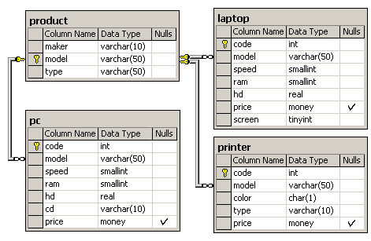

Описание учебных баз данных
===========================

1 - Компьютерная фирма
---------------------

Схема БД состоит из четырех таблиц:  
* Product(maker, model, type)
* PC(code, model, speed, ram, hd, cd, price)  
* Laptop(code, model, speed, ram, hd, price, screen)  
* Printer(code, model, color, type, price)

Таблица Product представляет производителя (maker), номер модели (model) и тип ('PC' - ПК, 'Laptop' - ПК-блокнот или 'Printer' - принтер). Предполагается, что номера моделей в таблице Product уникальны для всех производителей и типов продуктов. 

В таблице PC для каждого ПК, однозначно определяемого уникальным кодом – code, указаны модель – model (внешний ключ к таблице Product), скорость - speed (процессора в мегагерцах), объем памяти - ram (в мегабайтах), размер диска - hd (в гигабайтах), скорость считывающего устройства - cd (например, '4x') и цена - price. 

Таблица Laptop аналогична таблице РС за исключением того, что вместо скорости CD содержит размер экрана -screen (в дюймах). 

В таблице Printer для каждой модели принтера указывается, является ли он цветным - color ('y', если цветной), тип принтера - type (лазерный – 'Laser', струйный – 'Jet' или матричный – 'Matrix') и цена - price.

3 - Корабли
-----------

Рассматривается БД кораблей, участвовавших во второй мировой войне. Имеются следующие отношения:
* Classes (class, type, country, numGuns, bore, displacement)
* Ships (name, class, launched)
* Battles (name, date)
* Outcomes (ship, battle, result)

Корабли в «классах» построены по одному и тому же проекту, и классу присваивается либо имя первого корабля, построенного по данному проекту, либо названию класса дается имя проекта, которое не совпадает ни с одним из кораблей в БД. Корабль, давший название классу, называется головным.

Отношение Classes содержит имя класса, тип (bb для боевого (линейного) корабля или bc для боевого крейсера), страну, в которой построен корабль, число главных орудий, калибр орудий (диаметр ствола орудия в дюймах) и водоизмещение ( вес в тоннах). 

В отношении Ships записаны название корабля, имя его класса и год спуска на воду. 

В отношение Battles включены название и дата битвы, в которой участвовали корабли, а в отношении Outcomes – результат участия данного корабля в битве (потоплен-sunk, поврежден - damaged или невредим - OK).

Замечания. 1) В отношение Outcomes могут входить корабли, отсутствующие в отношении Ships. 2) Потопленный корабль в последующих битвах участия не принимает.

